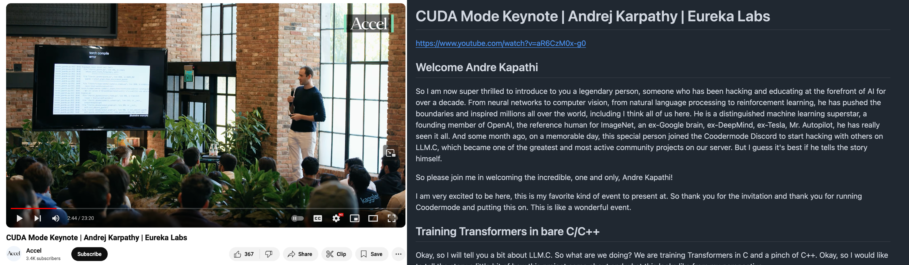

# yt2doc



yt2doc transcribes videos & audios online into readable Markdown documents.

Supported video/audio sources:
* YouTube
* Apple Podcast
* Twitter

yt2doc is meant to work fully locally, without invoking any external API. The OpenAI SDK dependency is required solely to interact with a local LLM server such as [Ollama](https://github.com/ollama/ollama).

Check out some [examples](./examples/) generated by yt2doc.

## Why

There have been many existing projects that transcribe YouTube videos with Whisper and its variants, but most of them aimed to generate subtitles, while I had not found one that priortises readability. Whisper does not generate line break in its transcription, so transcribing a 20 mins long video without any post processing would give you a huge piece of text, without any line break or topic segmentation. This project aims to transcribe videos with that post processing. 

## Installation

### Prerequisites

[ffmepg](https://www.ffmpeg.org/) is required to run yt2doc.

If you are running MacOS:

```
brew install ffmpeg
```

If you are on Debian/Ubuntu:
```
sudo apt install ffmpeg
```

If you are on Windows, follow the instruction on the ffmpeg [website](https://ffmpeg.org/download.html#build-windows). If you have installed Scoop on Windows:

```
scoop install ffmpeg
```

### Install yt2doc

Install with [pipx](https://github.com/pypa/pipx):

```
pipx install yt2doc
```

Or install with [uv](https://github.com/astral-sh/uv):
```
uv tool install yt2doc
```

### Upgrade

If you have already installed yt2doc but would like to upgrade to a later version:

```
pipx upgrade yt2doc
```

or with `uv`:

```
uv tool upgrade yt2doc
```

## Usage

Get helping information:

```
yt2doc --help
```

### Transcribe Video from Youtube or Twitter

To transcribe a video (on YouTube or Twitter) into a document:

```
yt2doc --video <video-url>
```

To save your transcription:

```
yt2doc --video <video-url> -o some_dir/transcription.md
```

### Transcribe a YouTube playlist

To transcribe all videos from a YouTube playlist:

```
yt2doc --playlist <playlist-url> -o some_dir
```

### Chapter unchaptered videos

(LLM server e.g. [Ollama](https://github.com/ollama/ollama) required) If the video is not chaptered, you can chapter it and add headings to each chapter:

```
yt2doc --video <video-url> --segment-unchaptered --llm-model <model-name>
```

Among smaller size models, `gemma2:9b`, `llama3.1:8b`, and `qwen 2.5:7b` work reasonably well.

By default, yt2doc talks to Ollama at `http://localhost:11434/v1` to segment the text by topic. You can run yt2doc to interact with Ollama at a different address or port, a different (OpenAI-compatible) LLM server (e.g. [vLLM](https://github.com/vllm-project/vllm), [mistral.rs](https://github.com/EricLBuehler/mistral.rs)), or even OpenAI itself, by

```
yt2doc --video <video-url> --segment-unchaptered --llm-server <llm-server-url> --llm-api-key <llm-server-api-key> --llm-model <model-name>
```

### Transcribe Apple Podcast

To transcribe a podcast episode on Apple Podcast:

```
yt2doc --audio <apple-podcast-episode-url> --segment-unchaptered --llm-model <model-name>
```

### Whisper configuration

By default, yt2doc uses [faster-whisper](https://github.com/SYSTRAN/faster-whisper) as transcription backend. You can run yt2doc with different faster-whisper configs (model size, device, compute type etc):

```
yt2doc --video <video-url> --whisper-model <model-name> --whisper-device <cpu|cuda|auto> --whisper-compute-type <compute_type>
```

For the meaning and choices of `--whisper-model`, `--whisper-device` and `--whisper-compute-type`, please refer to this [comment](https://github.com/SYSTRAN/faster-whisper/blob/v1.0.3/faster_whisper/transcribe.py#L101-L127) of faster-whisper.


If you are running yt2doc on Apple Silicon, [whisper.cpp](https://github.com/ggerganov/whisper.cpp) gives much faster performance as it supports the Apple GPU. (A hacky) Support for whisper.cpp has been implemented:

```
yt2doc --video --whisper-backend whisper_cpp --whisper-cpp-executable <path-to-whisper-cpp-executable>  --whisper-cpp-model <path-to-whisper-cpp-model>
```

See https://github.com/shun-liang/yt2doc/issues/15 for more info on whisper.cpp integration.


### Text segmentation configuration

yt2doc uses [Segment Any Text (SaT)](https://github.com/segment-any-text/wtpsplit) to segment the transcript into sentences and paragraphs. You can change the SaT model:
```
yt2doc --video <video-url> --sat-model <sat-model>
```

List of available SaT models [here](https://github.com/segment-any-text/wtpsplit?tab=readme-ov-file#available-models).


### Ignore chapters from source

Sometimes, the chaptering of the video/audio at the source does not segment the content in the way you are happy about. You can ask yt2doc to ignore the source chaptering by

```
yt2doc --video <video-url> --ignore-chapters --segment-unchaptered --llm-model <model-name>
```

### Run in Docker

To run yt2doc in Docker, first pull the image from ghcr:

```
docker pull ghcr.io/shun-liang/yt2doc
```

Then just run:

```
docker run ghcr.io/shun-liang/yt2doc --video <video-url>
```

If you are running Ollama (or any LLM server) locally and you want to segment the unchapter video/audio, you need to use the [host](https://docs.docker.com/engine/network/drivers/host/) network driver. Also, if you want to save the document to the host filesystem, you need [mount](https://docs.docker.com/engine/storage/bind-mounts/) a host directory to the Docker container. For example, if you run Ollam at `http://localhost:11434` on host, and you want yt2doc to write to `<directory-on-host>` on the host filesystem, then

```
docker run --network="host" --mount type=bind,source=<directory-on-host>,target=/app  ghcr.io/shun-liang/yt2doc --video <video-url> --segment-unchaptered --llm-server http://host.docker.internal:11434/v1 --llm-model <llm-model> -o .
```